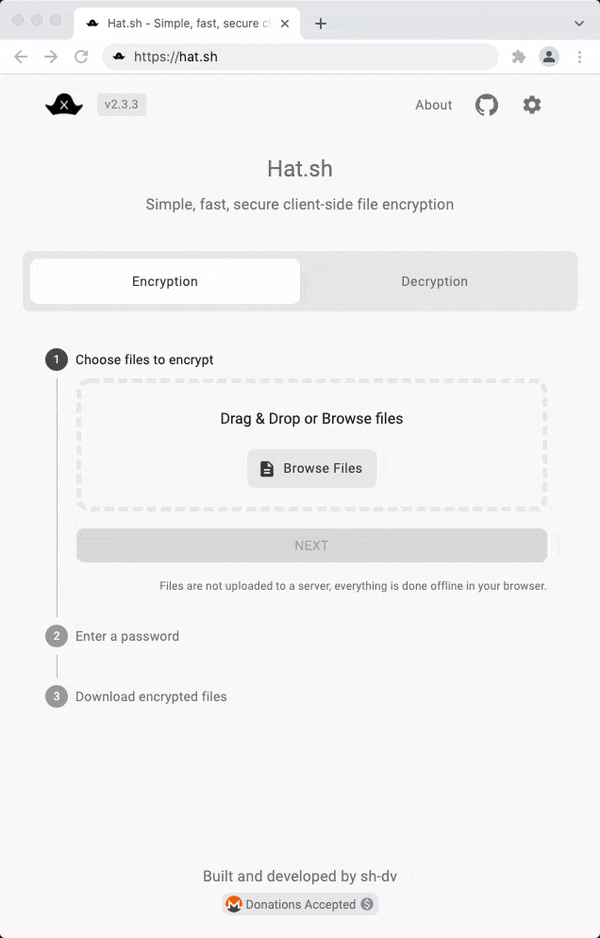

<!--
N.B.: This README was automatically generated by https://github.com/YunoHost/apps/tree/master/tools/README-generator
It shall NOT be edited by hand.
-->

# Hat.sh for YunoHost

[](https://dash.yunohost.org/appci/app/hat)    
[](https://install-app.yunohost.org/?app=hat)

*[Lire ce readme en français.](./README_fr.md)*

> *This package allows you to install Hat.sh quickly and simply on a YunoHost server.
If you don't have YunoHost, please consult [the guide](https://yunohost.org/#/install) to learn how to install it.*

## Overview

Hat.sh is a web app that provides secure local file encryption in the browser. It's fast, secure, and uses modern cryptographic algorithms with chunked AEAD stream encryption/decryption.

### Features

#### Security

- XChaCha20-Poly1305 - for symmetric encryption.
- Argon2id - for password-based key derivation.
- X25519 - for key exchange.

#### Privacy

- The app runs locally in your browser.
- No data is ever collected or sent to anyone.​

#### Functionality

- Secure multiple file encryption/decryption with passwords or keys.
- Secure random password generation.
- Asymmetric key pair generation.
- Authenticated key exchange.
- Password strength estimation.


**Shipped version:** 2.3.6~ynh1

**Demo:** https://hat.sh

## Screenshots



## Disclaimers / important information

Hat.sh requires a dedicated domain or subdomain.
## Documentation and resources

* Official app website: <hat.sh>
* Official user documentation: <https://yunohost.org/apps>
* Official admin documentation: <https://hat.sh/about/>
* Upstream app code repository: <https://github.com/sh-dv/hat.sh>
* YunoHost documentation for this app: <https://yunohost.org/app_hat>
* Report a bug: <https://github.com/YunoHost-Apps/hat_ynh/issues>

## Developer info

Please send your pull request to the [testing branch](https://github.com/YunoHost-Apps/hat_ynh/tree/testing).

To try the testing branch, please proceed like that.

``` bash
sudo yunohost app install https://github.com/YunoHost-Apps/hat_ynh/tree/testing --debug
or
sudo yunohost app upgrade hat -u https://github.com/YunoHost-Apps/hat_ynh/tree/testing --debug
```

**More info regarding app packaging:** <https://yunohost.org/packaging_apps>
