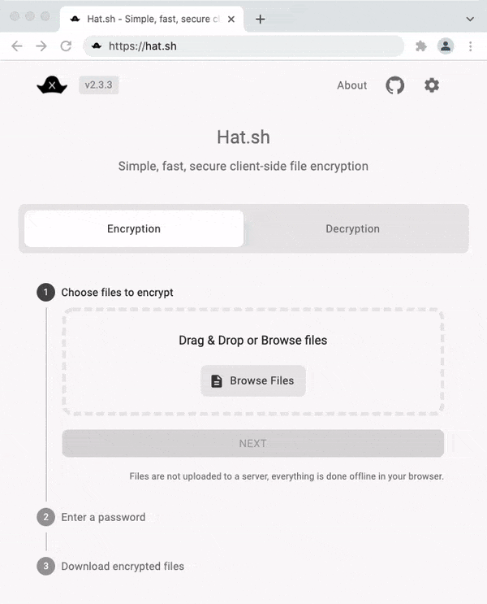

<!--
Este archivo README esta generado automaticamente<https://github.com/YunoHost/apps/tree/master/tools/readme_generator>
No se debe editar a mano.
-->

# Hat.sh para Yunohost

[](https://dash.yunohost.org/appci/app/hat)  

[](https://install-app.yunohost.org/?app=hat)

*[Leer este README en otros idiomas.](./ALL_README.md)*

> *Este paquete le permite instalarHat.sh rapidamente y simplement en un servidor YunoHost.*  
> *Si no tiene YunoHost, visita [the guide](https://yunohost.org/install) para aprender como instalarla.*

## Descripción general

Hat.sh is a web app that provides secure local file encryption in the browser. It's fast, secure, and uses modern cryptographic algorithms with chunked AEAD stream encryption/decryption.


**Versión actual:** 2.3.6~ynh3

**Demo:** <https://hat.sh>

## Capturas



## Documentaciones y recursos

- Sitio web oficial: <hat.sh>
- Documentación administrador oficial: <https://hat.sh/about/>
- Repositorio del código fuente oficial de la aplicación : <https://github.com/sh-dv/hat.sh>
- Catálogo YunoHost: <https://apps.yunohost.org/app/hat>
- Reportar un error: <https://github.com/YunoHost-Apps/hat_ynh/issues>

## Información para desarrolladores

Por favor enviar sus correcciones a la [`branch testing`](https://github.com/YunoHost-Apps/hat_ynh/tree/testing

Para probar la rama `testing`, sigue asÍ:

```bash
sudo yunohost app install https://github.com/YunoHost-Apps/hat_ynh/tree/testing --debug
o
sudo yunohost app upgrade hat -u https://github.com/YunoHost-Apps/hat_ynh/tree/testing --debug
```

**Mas informaciones sobre el empaquetado de aplicaciones:** <https://yunohost.org/packaging_apps>
